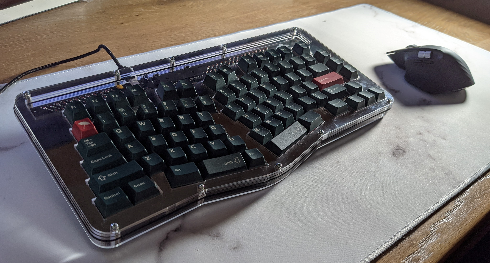
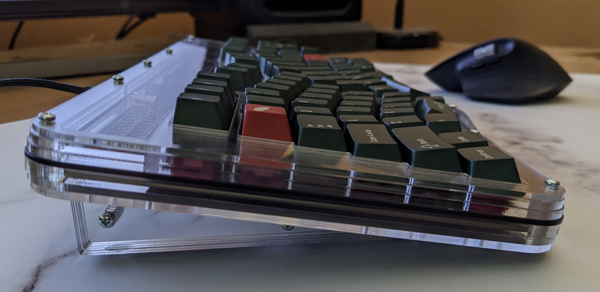
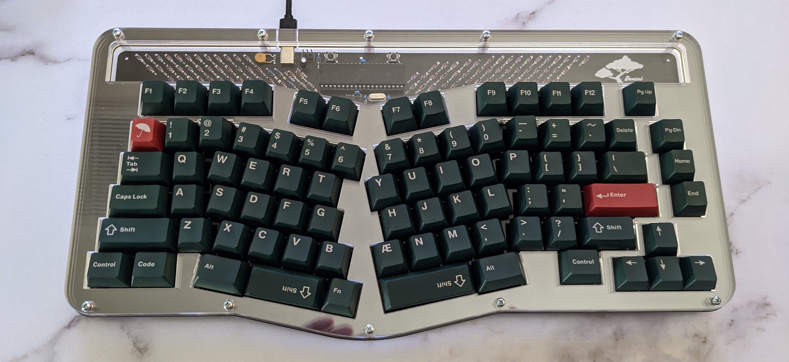

# Acrylic Case for the Bonsai

This is a layered acrylic case design for the Bonsai.  The USB cutout might be a little slim so if your custom USB cable uses more than heatshrink to wrap the USB C end it probably won't fit.

If you plan to build the Bonsai with this case make sure to only order the main pcb and not the base plate or switch plate as this case will negate the need for both.

If you order this from Ponoko here are the material types and thicknesses to use:

01 - Bonsai-Top1-2mm - As the file name suggests use 2mm acrylic.

02 - Bonsai-Top2-3mm - 3mm acrylic

03 - Bonsai-Top3-3mm - 3mm acrylic

04 - Bonsai-Plate-1-5mm - 1.5mm Delrin.  This can be black or white.

05 - Bonsai-BottomOpen-4-5mm - 4.5mm acrylic

06 - Bonsai-BottomClosedwFeet-3mm - 3mm acrylic

07 - Bonsai-Bottom03mm - 3mm acrylic

You will also need [10 M2.5 14mm standoffs](https://www.harwin.com/products/R25-1001402/), [4 M2.5 11mm standoffs](https://www.harwin.com/products/R25-1001102/), [4 M2 4mm nuts](https://www.harwin.com/products/M80-2430000B/), [4 M2 6mm screws](https://www.amazon.com/gp/product/B07HGNNCLV/), and [14 M2.5 5mm screws](https://www.amazon.com/Machine-Plated-Phillips-M2-5-0-45-Threads/dp/B000NHVPPO/).
