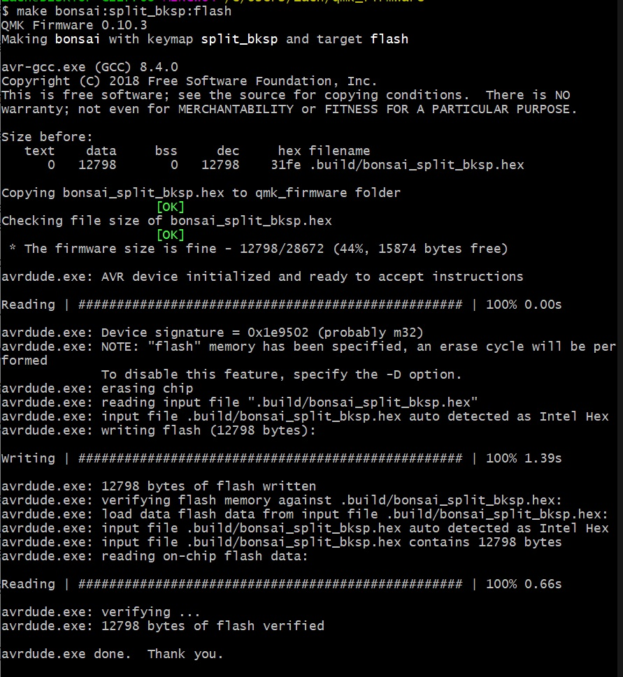

# Acrylic Bonsai

This is a guide from start to finish of how to build an FR4 sandwich Bonsai keyboard.


1. Go to https://jlcpcb.com/ and order ONLY the "PCB Gerbers.zip" from the [Gerbers folder](https://github.com/Retne01/Bonsai/tree/master/Gerbers).  The MOQ for JLC prototypes is 5 so you will end up with 5 PCBs.

2. Order all the parts you need from the [bill of materials](https://octopart.com/bom-tool/dQECSo9X).  What vendor you choose will be up to you.  I used [Mouser](https://www.mouser.com/) and if you choose to go with them I recommend stating that you would like the parts to ship separately.  When I ordered from them I did not select this and I watched items cycle in and out of stock without them setting anything aside for my order which was very frustrating.  Another place that might be worth looking at is [LCSC](https://lcsc.com/).  I recommend trying to find a place with the majority of the items in stock if not all of them in stock as the parts are pretty darn cheap and the cost will increase exponentially if you're having to pay for shipping from multiple vendors.  I also recommend checking with your local electronic parts stores as it's always good to support local businesses.  Even if they don't stock these parts regularly they might be able to special order them for you and save you a bunch of hassle.

3. Order the acrylic case, standoffs, and screws that you will need to assemble the case.  [The files for the case can be found here](https://github.com/Retne01/Bonsai/tree/master/Case).  Pay attention to the recommended thicknesses for ordering the acrylic case from [Ponoko](https://www.ponoko.com/).  You will only need to order one of each file unless you plan to make multiple boards.  The more you order the bigger the discount.  When I ordered one case I chose to take the long wait for free shipping and the price came to roughly $127 and took roughly a month and a half to arrive.  You can also find at the bottom of that ReadMe the amount, types, and sizes of standoffs and screws.  The links to the standoffs should take you to the Harwin site and if you scroll down you can find some suggested vendors depending on where you're ordering from.  I used Mouser as the supplier of my standoffs and Amazon for the scews.  Be sure to order the [Harwin 4mm nuts](https://www.harwin.com/products/M80-2430000B/) otherwise you'll have to edit the acrylic feet to fit your chosen nut.

4. Make sure that you have a soldering iron, some steel mesh to clean your soldering iron, some flux, some solder, and a solder sucker.  I also recommend soldering in a well ventilated area and try to have a fan pulling the solder away from the solder site as inhaling solder fumes on the regular is not good for your health.

5. Once all the parts arrive get everything together and make sure you have the correct number of parts for your build.  You should have 1x ATmega32A, 2x 75ohm resistors, 1x 1.5k resistor, 2x 5.1k resistors, 1x 10k resistor, 1x 4.7uF capacitor, 2x 0.1uF capacitors, 2x 22pF capacitors, 2x 4-pin switches, 1x 6-pin connection header, 2x 3.6v zener diodes, 1x 40-pin IC socket, 82x 1N4148 diodes, 1x 0.5amp fuse, 1x 16MHz crystal, and 1x USB-C port.

6. Solder 82 141N Diodes.  These have a specific orientation.  The black bar will be oriented upwards and go on the side with the square pad.

7. Solder the 2x 3.6v zener diodes.  These have a specific orientation.  The black bar will be oriented upwards and go on the side with the square pad.

8. Solder the 2x 75ohm, 1.5k, 2x 5.1k, and 10k resistors.  These do not hace a specific orientation.

9. Solder the USB-C port.  This will be the most dificult part and I recommend having flux on hand.  Insert the port and then solder one of the large legs to secure the port to the board.  Then heat the one leg you soldered up and press the port into the board to make sure it is flush with the board.  Apply a large amount of flux to the soldering area.  This will help you to not bridge any of the pins.  Solder the 3 legs.  Now take your iron and apply solder to the iron itself and then drag it across the pins.  Inspect to make sure all the pins are soldered and that none of them are connected to each other with solder.  If you do have two pins connected with solder, clean your iron and then heat the area with the bridged pins and pull away some of the solder.  If when you plug the board into your computer for testing you get a USB port voltage error you will know you have bridged pins and you need to inspect them again, apply flux, and try to pull away solder until none of the pins are touching but they are all soldered.

10. Solder the 2x 4-pin switches.  These have no specific orientation.

11. Solder the 0.5amp fuse.  This has no specific orientation.

12. Solder the 6-pin header.  The longer side is the bit you want sticking out of the top of your board.  I would recommend soldering 1 pin and then reheating that 1 pin and pressing the header in to make sure it sits flush with the board.

13. Solder the 16MHz crystal.  This has no specific orientation.

14. Solder the 2x 22pF capacitors.  These have no specific orientation.

15. Solder the 2x 0.1uF capacitors.  These have no specific orientation.

16. Solder the 40-pin IC socket.  This has a specific orientation.  Do not inset the MCU before soldering the IC socket.  Align the notch on the socket with the notch printed on the board.  Solder 2 pins in opposite corners.  Then reheat one pin and push down on that side and do the same with the other until the socket is flush with the board.

17. Insert the ATmega32A into the IC socket.  Be sure to line up the notch on the MCU with the notch on the socket.  You may need to gently bend the pin legs to get them aligned with the socket.  I recommend sticking one sideof the MCU's legs into the socket and gently bending the opposite legs to align with the socket and then gently pressing the MCU into the socket.

18. It's time to flash the bootloader.  Get your AVR programmer out and download [the bootloader](https://github.com/Retne01/Bonsai/tree/master/Bootloader).  Install [WinAVR](http://winavr.sourceforge.net/) and [set up your QMK build environment](https://beta.docs.qmk.fm/tutorial/newbs_getting_started).  If you are not using a Sparkfun Pocket AVR Programmer you will need to edit the makefile.inc to use the programmer of your choice.  Be sure to only edit the makefile.inc and not the makefile itself.  Once done connect your programmer to the 6-pin header and open MinGW64.  Navigate to the bootloader directory and run these two commands

	```make flash```
	```make fuse```

The USB bootloader should now be flashed.

19. Now we'll flash your desired QMK firmware layout to the MCU.  Connect the board to your computer with a USB cable and hold down the boot switch, tap the reset switch, and release the boot switch.  You can also hold down the boot switch while inserting the USB cable into the board if you prefer.  This will put the board into bootloader mode.  Make sure you've downloaded the [bonsai QMK source](https://github.com/Retne01/Bonsai/tree/master/QMK) and put it in $/qmk_firmware/keyboards/bonsai/.  Open MinGW64 and navigate to $/qmk_firmware/.  Then run one of the following commands depending on your preferred layout:

	```make bonsai:default:flash```
	
	```make bonsai:split_bksp:flash```

You should see something similar to this:



Your keyboard should now be flashed and you can now unplug the USB cable.

20.  Plug your board back in and test to make sure all of the switch holes are working in whatever keyboard tester you prefer.

21. Now grab your acrylic parts, standoffs, and screws.  You should have 6 acrylic layers and one POM/Delrin layer.  For your standoffs and screws you should have 10x M2.5 14mm standoffs, 4x M2.5 11mm standoffs, 4x M2 4mm nuts, 4x M2 6mm screws, and 14x M2.5 5mm screws.

22. Lube, assemble, and attach your stabalizers to the board.  You will need 4 or 5 depending on if you are splitting the backspace or not.

23. Line up the POM plate with the board and insert all of your switches.  If you have trouble getting them to insert fully into the plate you can insert almost all the switches into the plate and then line it up with the board to insert the last few.

24. Solder your switches into the board.  I recommend soldering one leg on a handful of switches around the board and then reflowing the joints while pressing the switches into the board to ensure you get them nice and flush with the PCB.  Once you've got everything sitting flush go ahead and solder the rest of your switch legs.

25. Now take the 12x acrylic triangles and separate them into 2 piles with 2 of each kind going into the piles.  Then take from one pile one of the triangles with the hexaganal cutouts but no notch and line it up with 2 of the triangles from the pile that have the hexaganal cutouts AND the notch.  Then align those with one of the triangles that only has screw holes from the same pile.  Slide 2x 11mm standoffs into the hexaganal holes and screw them into the triangle with screw holes.  Now slide 2x 4mm nuts into the notches, align the last triangle with hexaganal cutouts, and finally align the last triangle from the pile with screw holes and screw them into the standoffs.  Now duplicate the process with the other pile and you will have your case feet.

26. Use the 4x M2 screws to screw the feet into the base of the case (layer 7) by aligning the holes in the middle of the base with the nuts in the feet.

27. Now take layer 6 of the case and line it up with the base of the case.  Slot in all 10x M2.5 14mm standoffs and screw them into the base lightly.

28. Stack layer 5 on top of layer 6 and then slide the assembled board in.

29. Stack layer 3, 2, and 1 on top of the plate and screw the top into the standoffs.

Congratulations, you now have an Acrylic Bonsai to type away with.