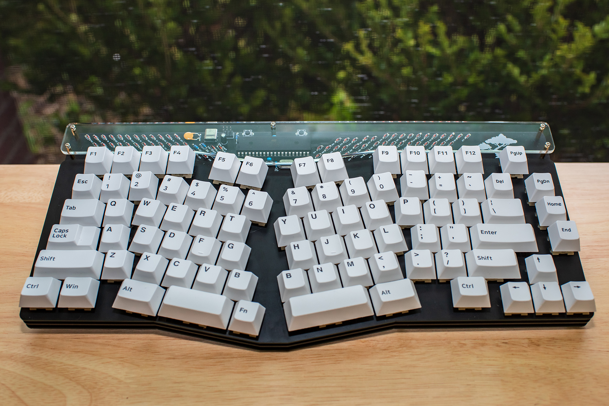
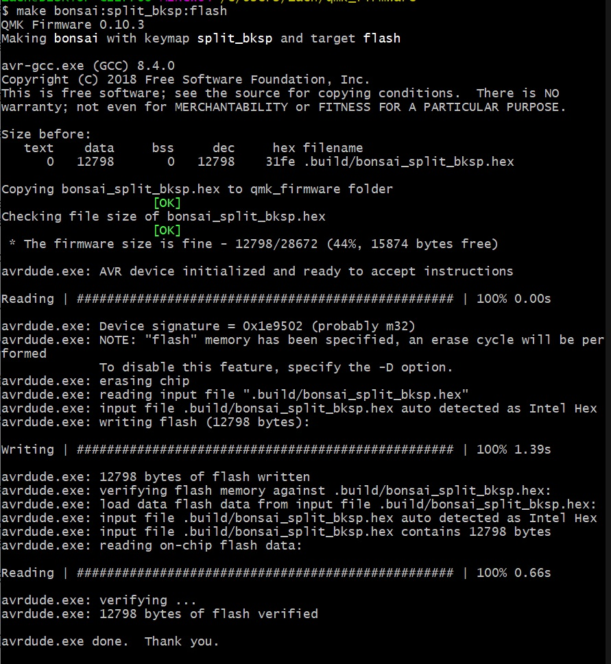

# FR4 Sandwich Bonsai

This is a guide from start to finish of how to build an FR4 sandwich Bonsai keyboard.

1. Go to https://jlcpcb.com/ and order all 3 gerbers from the [Gerbers folder](https://github.com/Retne01/Bonsai/tree/master/Gerbers).  There are 3 of them.  The base plate, the pcb, and the switch plate.  The MOQ for JLC prototypes is 5 so you will end up with 5 of each.  If they ask you about missing copper in the switch plate or base plate just tell them that you don't need copper in those but definitely make sure to go with a pcb color.  With default pcb coloring they may look worse than if you opt for something like Black.  They may also ask you about the drill holes being too close together on the switch plate.  Tell them that you will accept damages and they will make it.  I had all 5 of my FR4 switch plates come out just fine and I had to do this.

2. Order all the parts you need from the [bill of materials](https://octopart.com/bom-tool/dQECSo9X).  What vendor you choose will be up to you.  I used [Mouser](https://www.mouser.com/) and if you choose to go with them I recommend stating that you would like the parts to ship separately.  When I ordered from them I did not select this and I watched items cycle in and out of stock without them setting anything aside for my order which was very frustrating.  Another place that might be worth looking at is [LCSC](https://lcsc.com/).  I recommend trying to find a place with the majority of the items in stock if not all of them in stock as the parts are pretty darn cheap and the cost will increase exponentially if you're having to pay for shipping from multiple vendors.  I also recommend checking with your local electronic parts stores as it's always good to support local businesses.  Even if they don't stock these parts regularly they might be able to special order them for you and save you a bunch of hassle.

3. Order [some standoffs](https://www.amazon.com/gp/product/B07B9X1KY6/) and [bumpons](https://www.amazon.com/gp/product/B06XCGM8JT/) of [different heights](https://www.amazon.com/gp/product/B07KGKZFQN/).  The stuff I'm linking to here is what I ordered for my project but there may be better stuff out there.  The standoffs will determine the height of the PCB from the Base Plate and the bumpons will determine the angle of the board.  With the two bumpons I linked if the small ones are used at the front of the keyboard and the large ones at the back you will get roughly a 5-6 degree typing angle.  I haven't measured it but it lined up pretty close with my tofu65.

4. Order the acrylic window for your keyboard.  You can use the SVG [found here](https://github.com/Retne01/Bonsai/tree/master/Acrylic%20Top) to order them cut at [Ponoko](https://www.ponoko.com/) or whichever laser cutting service you prefer.  Just be sure to order clear acrylic to show off your soldering work!

5. Make sure that you have a soldering iron, some steel mesh to clean your soldering iron, some flux, some solder, and a solder sucker.  I also recommend soldering in a well ventilated area and try to have a fan pulling the solder fumes away from the solder site as inhaling solder fumes on the regular is not good for your health.

6. Once all the parts arrive get everything together and make sure you have the correct number of parts for your build.  You should have 1x ATmega32A, 2x 75ohm resistors, 1x 1.5k resistor, 2x 5.1k resistors, 1x 10k resistor, 1x 4.7uF capacitor, 2x 0.1uF capacitors, 2x 22pF capacitors, 2x 4-pin switches, 1x 6-pin connection header, 2x 3.6v zener diodes, 1x 40-pin IC socket, 82x 1N4148 diodes, 1x 0.5amp fuse, 1x 16MHz crystal, and 1x USB-C port.

7. Solder 82 141N Diodes.  These have a specific orientation.  The black bar will be oriented upwards and go on the side with the square pad.

8. Solder the 2x 3.6v zener diodes.  These have a specific orientation.  The black bar will be oriented upwards and go on the side with the square pad.

9. Solder the 2x 75ohm, 1.5k, 2x 5.1k, and 10k resistors.  These do not hace a specific orientation.

10. Solder the USB-C port.  This will be the most dificult part and I recommend having flux on hand.  Insert the port and then solder one of the large legs to secure the port to the board.  Then heat the one leg you soldered up and press the port into the board to make sure it is flush with the board.  Apply a large amount of flux to the soldering area.  This will help you to not bridge any of the pins.  Solder the 3 legs.  Now take your iron and apply solder to the iron itself and then drag it across the pins.  Inspect to make sure all the pins are soldered and that none of them are connected to each other with solder.  If you do have two pins connected with solder, clean your iron and then heat the area with the bridged pins and pull away some of the solder.  If when you plug the board into your computer for testing you get a USB port voltage error you will know you have bridged pins and you need to inspect them again, apply flux, and try to pull away solder until none of the pins are touching but they are all soldered.

11. Solder the 2x 4-pin switches.  These have no specific orientation.

12. Solder the 0.5amp fuse.  This has no specific orientation.

13. Solder the 6-pin header.  The longer side is the bit you want sticking out of the top of your board.  I would recommend soldering 1 pin and then reheating that 1 pin and pressing the header in to make sure it sits flush with the board.

14. Solder the 16MHz crystal.  This has no specific orientation.

15. Solder the 2x 22pF capacitors.  These have no specific orientation.

16. Solder the 2x 0.1uF capacitors.  These have no specific orientation.

17. Solder the 40-pin IC socket.  This has a specific orientation.  Do not inset the MCU before soldering the IC socket.  Align the notch on the socket with the notch printed on the board.  Solder 2 pins in opposite corners.  Then reheat one pin and push down on that side and do the same with the other until the socket is flush with the board.

18. Insert the ATmega32A into the IC socket.  Be sure to line up the notch on the MCU with the notch on the socket.  You may need to gently bend the pin legs to get them aligned with the socket.  I recommend sticking one sideof the MCU's legs into the socket and gently bending the opposite legs to align with the socket and then gently pressing the MCU into the socket.

19. It's time to flash the bootloader.  Get your AVR programmer out and download [the bootloader](https://github.com/Retne01/Bonsai/tree/master/Bootloader).  Install [WinAVR](http://winavr.sourceforge.net/) and [set up your QMK build environment](https://beta.docs.qmk.fm/tutorial/newbs_getting_started).  If you are not using a Sparkfun Pocket AVR Programmer you will need to edit the makefile.inc to use the programmer of your choice.  Be sure to only edit the makefile.inc and not the makefile itself.  Once done connect your programmer to the 6-pin header and open MinGW64.  Navigate to the bootloader directory and run these two commands

	make flash
	make fuse

The USB bootloader should now be flashed.

20. Now we'll flash your desired QMK firmware layout to the MCU.  Connect the board to your computer with a USB cable and hold down the boot switch, tap the reset switch, and release the boot switch.  You can also hold down the boot switch while inserting the USB cable into the board if you prefer.  This will put the board into bootloader mode.  Make sure you've downloaded the [bonsai QMK source](https://github.com/Retne01/Bonsai/tree/master/QMK) and put it in $/qmk_firmware/keyboards/bonsai/.  Open MinGW64 and navigate to $/qmk_firmware/.  Then run one of the following commands depending on your preferred layout:

	make bonsai:default:flash
	
	make bonsai:split_bksp:flash

You should see something similar to this:

Your keyboard should now be flashed and you can now unplug the USB cable.

21. Plug your board back in and test to make sure all of the switch holes are working in whatever keyboard tested you prefer.

22. Now you will need to gather your standoffs, screws, MX switches of your choice, the switch plate, and the base plate.

23. Choose the height of standoff you want for connected the base plate to the board and be sure to use female to female standoffs.  Screw the standoffs that connect below the switch plate into the bottom of the board.  Then screw in the 5 standoffs that go into the top of the board.  For the top of the board you will use the longer male to female standoffs and female to female standoffs of the same size as the ones you previously selected on the bottom of the board.

24. Lube, assemble, and attach your stabalizers to the board.

25. Insert the MX switches into the switch plate and into the board.

26. Solder one leg of a handful of switches across the board to act as anchor points.  Then reflow each switch and be sure to push it all the way into the board until it is flush with the board.  Then solder the rest of the switch legs.

27. Screw in the base plate to the standoffs on the back of the board and screw the acrylic window into the standoffs at the top of the board.

Congratulations, you now have an FR4 Bonsai of your very own.