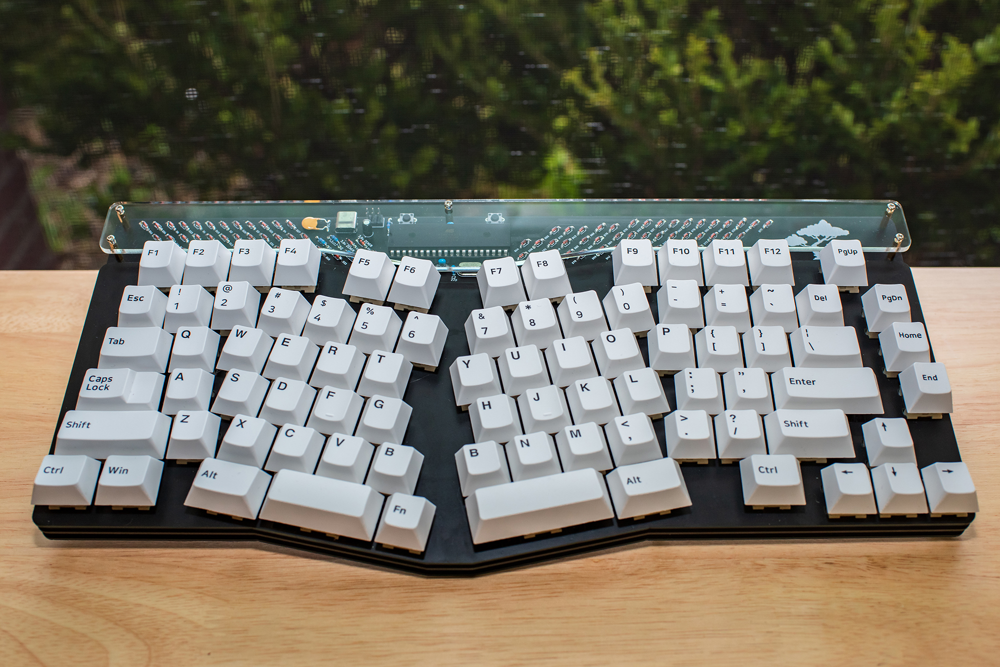
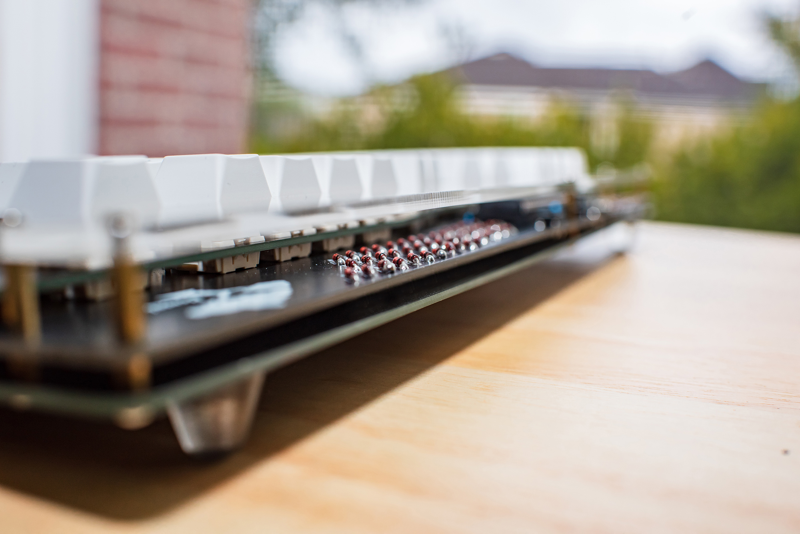
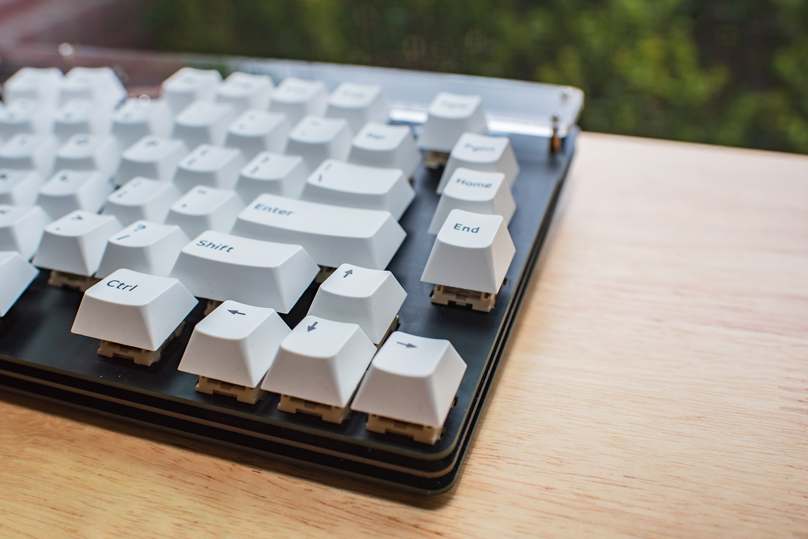
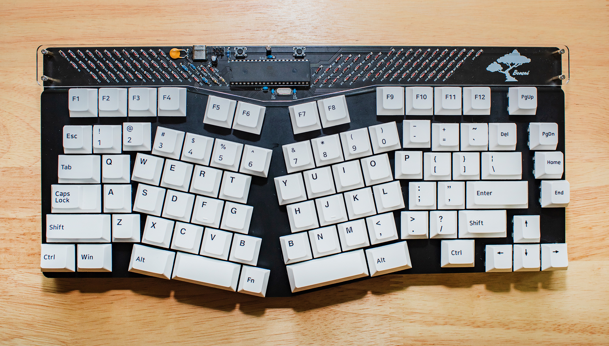

# Bonsai
This is a completely through hole 75% take on the TGR Alice layout.

If you plan on putting this together for yourself you will need to use the 3 gerber zips to order a switch plate, the pcb, and base plate.  If they ask about there being no copper on the base plate or switch plate tell them that they do not need it.  Also if they ask about the closeness of drilled holes just tell them you will accept a damaged product.  All of my switch plates came out just fine so barring a freak accident they should work.  I ordered my prototype pcb from JLC.

To flash the bootloader you will need an AVR programmer.  I used a Sparkfun Pocket AVR Programmer which is what the Makefile.inc is set to.  If you are using a different programmer make sure to set it in the Makefile.inc.  Always edit the Makefile.inc and NOT the Makefile itself.  I would recommend using MSYS2 instead of the suggested build environment in the bootloader readme as WinAVR is very out of date.  Just follow the build environment setup in [the QMK guide here](https://beta.docs.qmk.fm/tutorial/newbs_getting_started#2-prepare-your-build-environment-id-set-up-your-environment) if you're using Windows.

[Here is the BOM.](https://octopart.com/bom-tool/dQECSo9X)  All the parts are labeled on the board.  I don't have a build guide put together right now but I have faith that anyone ordering this for themselves can figure out where the parts go on the board.  Just make sure to get your diodes and MCU oriented right.

