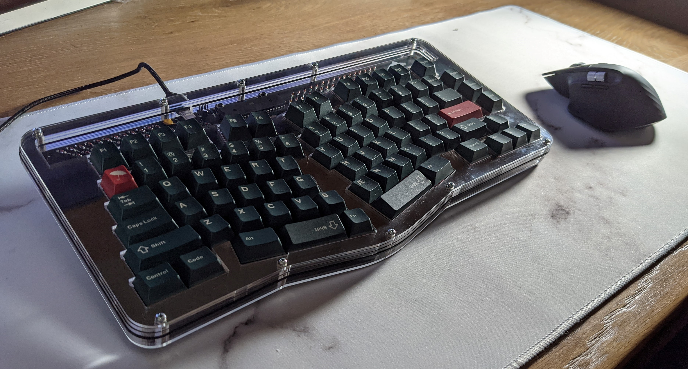

# Bonsai
This is a completely through hole 75% take on the TGR Alice layout.

If you want to put one together for yourself you can follow the guide for the FR4 sandwich style pictured above you can follow [the guide here](./Guides/FR4/)  If you would prefer to make an acrylic style case as pictured below you can follow [the guide here](./Guides/Acrylic/).

